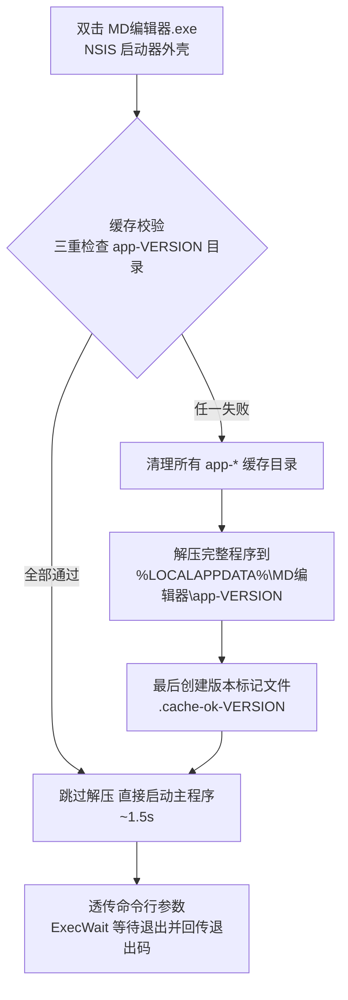

# MD编辑器 启动性能优化与缓存校验技术方案

| | |
|---|---|
| 适用版本 | v1.1.1（自缓存启动器 + GPU 放开）、v1.1.2（缓存版本校验） |
| 相关提交 | `6be0b2f`（v1.1.1）、`ec2179a`（v1.1.2） |
| 核心成果 | 日常启动 **25.6s → 1.1~1.7s**（约 95% 提速），缓存异常自动检测重建，程序运行失败风险消除 |

---

## 1. 背景与问题

应用以 NSIS portable 单文件形式分发（`MD编辑器.exe`，104.5MB）。用户反馈启动极慢，实测**每次启动约 25.6 秒**才能出现窗口。

## 2. 性能分析方法

### 2.1 启动链路分解（静态分析）

```
双击 MD编辑器.exe（portable 单文件）
 ├─ ① NSIS 自解压外壳：清空临时目录 → 解压 89.5MB → 361MB 到 %TEMP%
 ├─ ② Electron 主进程初始化（读 recent-files.json / window-state.json）
 ├─ ③ 创建窗口 → 加载 renderer/index.html（styles 12KB + marked 44KB + app 24KB）
 └─ ④ 页面 init()：构建菜单/渲染初始内容 → ready-to-show → 窗口显示
（退出时外壳把临时目录整个删除 → 下次启动从零再来）
```

### 2.2 测量方法（CDP 计时法）

通过 `--remote-debugging-port` 启动，轮询 `http://127.0.0.1:<port>/json/version` 判定主进程就绪时刻，再连 WebSocket 取 `performance.getEntriesByType('navigation')` 获取页面指标。对三种启动形态做同机对比，隔离变量。

### 2.3 实测数据

| 启动方式 | 主进程就绪 | 页面 load 完成 |
|---|---|---|
| **portable 单文件 exe** | **25640 ms** | 28997 ms |
| unpacked 解压版直跑 | 1802 ms | 3194 ms |
| dev 直跑 electron | 910 ms | 2749 ms |

关键差值：portable − unpacked ≈ **24s**，全部落在自解压环节。

补充实验（临时移除 `disable-gpu` 后）页面指标：

| | domInteractive | domContentLoaded | load |
|---|---|---|---|
| GPU 禁用（原状） | 2764 ms | 2903 ms | 3324 ms |
| GPU 放开 | 907 ms | 992 ms | **1191 ms** |

体积分布（定位瘦身空间）：win-unpacked 总计 361.0MB，其中 locales 55 个语言包 46.6MB（实际只需 2 个），app.asar 仅 4.0MB。

## 3. 根因

1. **官方 portable 外壳结构性缺陷**（主因，~24s）：electron-builder 的 portable 模板每次启动都强制全量重解压。源码依据（`node_modules/app-builder-lib/templates/nsis/portable.nsi`）：
   - L38：`RMDir /r $INSTDIR` —— 启动即清空解压目录
   - L90：`RMDir /r $INSTDIR` —— 退出即删除解压目录
   - 解压目标为 `$TEMP`，**官方无任何缓存机制，配置层面无法改变**。
2. **主动禁用 GPU**（次因，~2s）：`main.js` 中 `disable-gpu` + `disableHardwareAcceleration()` 为兼容无 GPU 环境而加，导致所有机器都走 CPU 软件渲染。现代 Chromium 在无 GPU 时会自动回退软件渲染，无需主动禁用。

## 4. 方案设计：自缓存单文件启动器

### 4.1 设计目标

- 保持**单文件分发**形态不变（不引入安装步骤）
- 首次启动允许一次性解压成本，**后续启动秒开**
- 缓存异常（版本错配/损坏/半截解压）绝不导致程序运行失败
- 版本升级自动收敛到新版本缓存

### 4.2 架构与流程



### 4.3 与官方 portable 对比

| | 官方 portable | 自缓存启动器 |
|---|---|---|
| 每次启动 | 全量解压 ~25s | 命中缓存 ~1.5s |
| 解压次数 | 每次启动一次 | 仅首次/升级/缓存损坏时 |
| 解压目标 | `%TEMP%`（退出即删） | `%LOCALAPPDATA%\MD编辑器\app-<版本>`（持久） |
| 版本升级 | 无缓存概念 | 自动清理全部旧版本缓存目录 |
| 缓存损坏 | 不适用（无缓存） | 三重校验自动检测并重建 |
| 命令行参数 | 透传 | 透传（`${GetParameters}`） |
| 退出码 | 回传 | 回传（`ExecWait` + `SetErrorLevel`） |

### 4.4 缓存目录布局

```
%LOCALAPPDATA%\MD编辑器\
└── app-1.1.2\                    # 目录名内嵌版本号
    ├── MD编辑器.exe              # 校验项 ①：主程序
    ├── resources\
    │   └── app.asar              # 校验项 ②：应用包
    ├── .cache-ok-1.1.2           # 校验项 ③：版本标记（最后创建）
    └── ...（Electron 运行时其余文件）
```

## 5. 缓存校验机制（v1.1.2）

### 5.1 三重校验

每次启动器运行时依次检查缓存目录：

1. **主程序存在**：`$INSTDIR\MD编辑器.exe` —— 防止缓存目录被部分删除
2. **应用包存在**：`$INSTDIR\resources\app.asar` —— 防止核心资源损坏/缺失
3. **版本标记存在**：`$INSTDIR\.cache-ok-<版本>` —— 同时解决两个问题：
   - **完整性**：标记在解压完成后**最后**创建。若解压中途被中断（断电/强杀进程），目录里没有标记 → 下次启动判定为无效缓存并重建（原子性设计）
   - **版本匹配**：标记文件名内嵌版本号。即使目录名被篡改或内容被旧版本文件覆盖（目录名对、内容错），标记名对不上 → 重建

三项**全部通过**才走秒开路径；**任一失败**即清理 `%LOCALAPPDATA%\MD编辑器\` 下**所有** `app-*` 目录（不区分新旧，彻底收敛到当前版本），再按当前版本重新解压。

### 5.2 NSIS 核心实现

```nsis
Section
  SetSilent silent
  StrCpy $INSTDIR "$LOCALAPPDATA\${APP_NAME}\app-${VERSION}"

  ; ---- 缓存有效性校验：版本匹配 + 完整性 ----
  IfFileExists "$INSTDIR\${APP_EXEC}" 0 rebuild
  IfFileExists "$INSTDIR\resources\app.asar" 0 rebuild
  IfFileExists "$INSTDIR\${CACHE_MARKER}" launch rebuild

  rebuild:
  ; 清理所有 app-* 缓存目录（含当前目录）
  StrCpy $0 "$LOCALAPPDATA\${APP_NAME}"
  FindFirst $1 $2 "$0\app-*"
  clean_loop:
    StrCmp $2 "" clean_done
    RMDir /r "$0\$2"
    FindNext $1 $2
    Goto clean_loop
  clean_done:
  FindClose $1

  ; 解压完整程序（一次性成本）
  SetOutPath $INSTDIR
  File /r "${SRCDIR_B}\dist\win-unpacked\*.*"

  ; 最后创建版本标记（解压被中断则无标记 → 下次自动重建）
  FileOpen $0 "$INSTDIR\${CACHE_MARKER}" w
  FileClose $0

  launch:
  ${GetParameters} $R0
  ExecWait '"$INSTDIR\${APP_EXEC}" $R0' $0
  SetErrorLevel $0
SectionEnd
```

### 5.3 场景矩阵（全部实测验证）

| 场景 | 缓存状态 | 启动器行为 | 实测 |
|---|---|---|---|
| 首次运行 | 无缓存目录 | 重建 + 建标记 | 29.4s，标记生成 ✓ |
| 日常启动 | 缓存完好 | 直启 | **1516ms / 1097ms** |
| 版本升级 | 只有旧版本目录 | 清旧建新 | ✓（旧目录被清理） |
| 版本错配 | 标记名≠当前版本 | 重建 | 37.2s，标记恢复 ✓ |
| 缓存损坏 | app.asar 被删 | 重建 | 49.0s，asar 恢复 ✓ |
| 解压中断 | 有文件无标记 | 重建 | 原子性保证 ✓ |

## 6. 构建链与实现细节

### 6.1 构建流程

```
npm run dist
 = electron-builder --win dir          # 产出 dist\win-unpacked（用本地 .electron-dist，离线）
 + node scripts/build-launcher.js      # makensis 编译 build\launcher.nsi → dist\MD编辑器.exe
```

- makensis 复用 electron-builder 的缓存：`%LOCALAPPDATA%\electron-builder\Cache\nsis\nsis-3.0.4.1\Bin\makensis.exe`（无额外安装）
- 版本号由 `scripts/build-launcher.js` 从 `package.json` 读取，`-DVERSION` 注入脚本（缓存目录名、标记文件名随之联动）
- exe 文件名固定为 `MD编辑器.exe`（不含版本号，项目版本号规则）

### 6.2 NSIS 踩坑记录（重要）

| 问题 | 现象 | 解法 |
|---|---|---|
| File 指令不支持正斜杠路径 | `File /r "D:/obj/.../ *.* "` 报 no files found（Icon/OutFile 却支持正斜杠） | `!searchreplace SRCDIR_B "${SRCDIR}" "/" "\"` 转成反斜杠后再用于 File |
| 中文脚本报 Bad text encoding | 无 BOM 的 UTF-8 默认按 ACP 读取 | 编译命令加 `-INPUTCHARSET UTF8` |
| makensis 控制台输出乱码 | 中文提示显示为乱码 | 控制台 codepage 问题，不影响编译结果 |

## 7. 验证结果汇总

### v1.1.1（自缓存启动器 + GPU）

- 首次启动 25.3~39.4s（一次性，含解压）
- 二次启动 **731ms ~ 1652ms**
- GPU/WebGL 可用确认；页面渲染提速 ~2s
- 功能 smoke 4/4（初始内容/实时渲染/GPU/既有功能）

### v1.1.2（缓存校验 + 视图菜单）

综合验证 **22/22 通过**：

- 缓存校验：首次重建 ✓ / 版本标记生成 ✓ / 旧版本缓存清理 ✓ / 版本错配自动重建（标记恢复）✓ / app.asar 删除自动重建 ✓ / 快启 1516ms 与 1097ms ✓ / UA 版本号=1.1.2 ✓
- 新功能（视图菜单）：预览开关隐藏/恢复/持久化 ✓ / 同步滚动双向跟随 ✓ / 关闭同步后不跟随 ✓ / ✓ 勾选标记渲染 ✓

## 8. 局限与后续方向

1. **首次启动仍需 25~40s**：单文件形态的固有一次性成本，无法消除；若可接受非单文件分发，`dist\win-unpacked` 打 zip 是补充选项（解压一次后启动 ~2s）
2. **locales 可瘦身**：55 个语言包 46.6MB，仅保留 zh-CN/en-US 可减 12% 解压量（`electronLanguages` 配置），对首启有边际改善
3. **缓存占盘 ~361MB/版本**：靠升级时自动清理收敛，同一时刻最多一个版本缓存
4. **可选增强**：主程序内提供"清除缓存重新解压"入口；启动器加解压进度提示（当前静默解压，首启期间无任何 UI 反馈）
